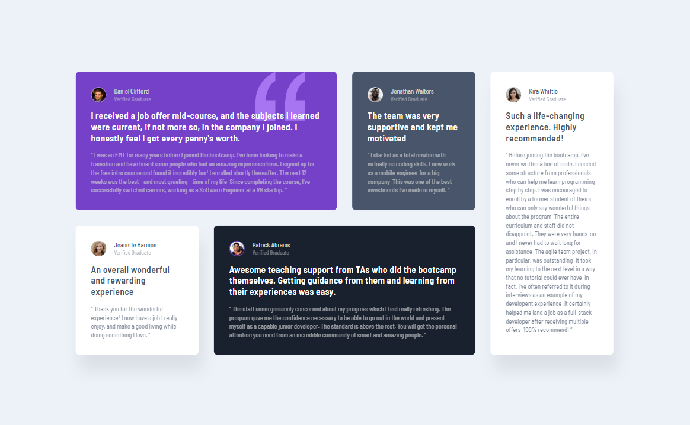

# Frontend Mentor - Testimonials grid section solution

This is a solution to the [Testimonials grid section challenge on Frontend Mentor](https://www.frontendmentor.io/challenges/testimonials-grid-section-Nnw6J7Un7).

## Table of contents

- [Overview](#overview)
  - [Challenge](#challenge)
  - [Screenshot](#screenshot)
  - [Links](#links)
- [My process](#my-process)
  - [Built with](#built-with)
  - [What I learned](#what-i-learned)
- [Author](#author)

## Overview

### Challenge

Users should be able to:

- View the optimal layout for the site depending on their device's screen size.

### Screenshot

### Links

- Solution URL: [See the code on GitHub](https://github.com/KristinaRadosavljevic/testimonials-grid-section)
- Live Site URL: [View live site](https://testimonials-grid-section-six-gules.vercel.app/)

## My process

### Built with

- Semantic HTML5 markup
- CSS/Sass
- CSS grid
- Media queries

### What I learned

This project gave me an opportunity to dig a bit deeper into CSS grid and become even more confortable with using it.

## Author

- LinkedIn - [Kristina Radosavljevic](https://www.linkedin.com/in/radosavljevic-kristina/)
- GitHub - [KristinaRadosavljevic](https://github.com/KristinaRadosavljevic)
- Frontend Mentor - [@KristinaRadosavljevic](https://www.frontendmentor.io/profile/KristinaRadosavljevic)
